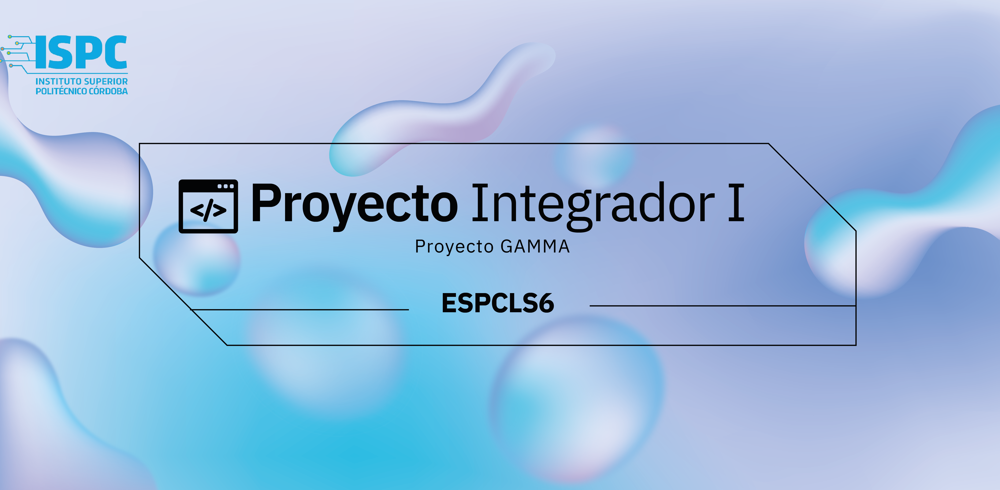

# PEOYECTO INTEGRADOR I
Nuestro grupo es **ESPCLS6** y somos estudiantes de primer año de la Tecnicatura Superior en Ciencias de Datos e Inteligencia Artificial del Instituto Superior Politécnico Córdoba.

+ Cecilia Espada
+ Luis Siccardi
+ Laura Peralta
+ Marilena Castilla
+ Gabriela López
+ Martín Solá

# PROYECTO
Este trabajo surge como propuesta del espacio curricular de *Proyecto Integrador I* a cargo de los profesores Silvia Perotti y Héctor Prado.

En esta oportunidad tenemos que desarrollar el “Proyecto Gamma” en el cual realizamos un Web Scraping para posteriormente guardar los datos obtenidos en una base de datos.

¿Qué es el Web Scraping? Es el proceso de extracción de datos almacenados en la web, cuyo objetivo es recopilar la información en un servidor y tiene múltiples aplicaciones como por ejemplo obtener información sobre un producto y sus reseñas en un eCommerce o  de las noticias de un diario digital para posteriormente realizar un análisis.
En esta ocasión nuestro proyecto se basa en la información obtenida en la página web de la Prefectura Naval Argentina, de la cual obtendremos la información sobre los niveles de los ríos. 

# DESARROLLO
Para la organización de nuestro equipo de trabajo utilizamos la herramienta Trello, en la cual nos dividimos las tareas a realizar. Para la realización del mismo utilizamos Python, las librerías Beautiful Soup, Requests  y Pandas. Luego la información obtenida la almacenamos en una base de datos utilizando MySQL.
